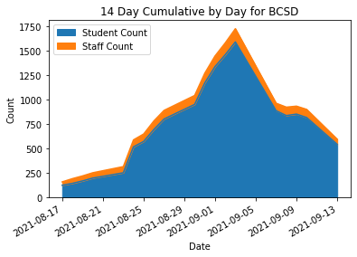
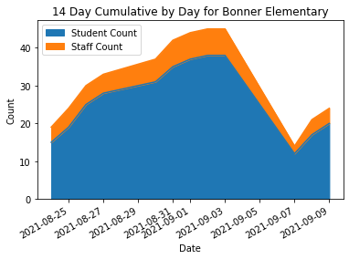
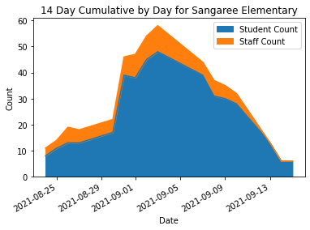

# BCSD Infographic notebook
This notebook provides various processing and infographics on COVID dashboard reporting for Berkeley County School District

## Data imported and added to dataframe

## List all schools and areas the district is tracking

    The school district is tracking 85 schools, offices or departments.
    Here is the full list.
    ['Berkeley County School District', 'Mount Holly Elementary', 'Academic Services', 'Administrative Services',
     'Adult Education - Hanahan', 'Adult Education - Moncks Corner', 'Berkeley Alternative', 'Berkeley Elementary',
     'Berkeley High School', 'Berkeley Intermediate', 'Berkeley Middle', 'Berkeley Middle College', 'Board of Education',
     'Bonner Elementary', 'Boulder Bluff Elementary', 'Bowens Corner Elementary', 'Cainhoy Elementary',
     'Cane Bay Elementary', 'Cane Bay High', 'Cane Bay Middle', 'Capital Improvements', 'Career Technical Ed', 'CDEP',
     'Child Nutrition', 'College Park Elementary', 'College Park Middle', 'Communications / Public Relations',
     'Cross Elementary', 'Cross High', 'Daniel Island School', 'Dist Office Transportation', 'Evaluation &amp; Leadership',
     'Financial Services', 'First Steps', 'Foxbank Elementary', 'Goose Creek Elementary', 'Goose Creek High',
     'Hanahan Elementary', 'Hanahan High', 'Hanahan Middle', 'Head Start', 'Howe Hall Aims', 'Human Resources',
     'JK Goudin Elementary', 'Lowcountry Regional Stem', 'Macedonia Middle', 'Maintenance', 'Marrington Elementary',
     'Marrington Middle', 'Nexton Elementary', 'Office of Diversity', 'Operations / Administration',
     'Philip Simmons Elementary', 'Philip Simmons High', 'Philip Simmons Middle', 'Program Support', 'Safety and Security',
     'Sangaree Elementary', 'Sangaree Intermediate', 'Sangaree Middle', 'Sedgefield Middle', 'Special Needs Transportation',
     'Special Services', 'St. Stephen Elementary', 'St. Stephen Middle', 'Stratford High', 'Teacher Forum', 'Technology',
     'Timberland High', 'Transportation - Cainhoy', 'Transportation - Cross', 'Transportation - Goose Creek',
     'Transportation - Moncks Corner', 'Transportation - St. Stephen', 'Westview Elementary', 'Westview Middle',
     'Westview Primary', 'Whitesville Elementary', 'Devon Forest Elementary', 'Central Offices', 'Transportation',
     'Jk Goudin Elementary', 'St Stephen Elementary', 'St Stephen Middle', 'Fishburne Campus']

## Top 5 Highest Schools Today

###  By Student Count

<table border="1" class="dataframe">
<thead>
<tr style="text-align: right;">
<th></th>
<th>School</th>
<th>Date</th>
<th>Staff Count</th>
<th>Student Count</th>
<th>Staff Close Contacts</th>
<th>Student Close Contacts</th>
</tr>
</thead>
<tbody>
<tr>
<th>1217</th>
<td>Stratford High</td>
<td>2021-09-20</td>
<td>1</td>
<td>27</td>
<td>3.0</td>
<td>133.0</td>
</tr>
<tr>
<th>1207</th>
<td>Nexton Elementary</td>
<td>2021-09-20</td>
<td>0</td>
<td>16</td>
<td>2.0</td>
<td>45.0</td>
</tr>
<tr>
<th>1177</th>
<td>Berkeley High School</td>
<td>2021-09-20</td>
<td>3</td>
<td>16</td>
<td>1.0</td>
<td>111.0</td>
</tr>
<tr>
<th>1187</th>
<td>Cane Bay Middle</td>
<td>2021-09-20</td>
<td>0</td>
<td>16</td>
<td>1.0</td>
<td>91.0</td>
</tr>
<tr>
<th>1186</th>
<td>Cane Bay High</td>
<td>2021-09-20</td>
<td>0</td>
<td>11</td>
<td>0.0</td>
<td>112.0</td>
</tr>
</tbody>
</table>

### By Staff Count

<table border="1" class="dataframe">
<thead>
<tr style="text-align: right;">
<th></th>
<th>School</th>
<th>Date</th>
<th>Staff Count</th>
<th>Student Count</th>
<th>Staff Close Contacts</th>
<th>Student Close Contacts</th>
</tr>
</thead>
<tbody>
<tr>
<th>1177</th>
<td>Berkeley High School</td>
<td>2021-09-20</td>
<td>3</td>
<td>16</td>
<td>1.0</td>
<td>111.0</td>
</tr>
<tr>
<th>1188</th>
<td>College Park Elementary</td>
<td>2021-09-20</td>
<td>2</td>
<td>5</td>
<td>3.0</td>
<td>55.0</td>
</tr>
<tr>
<th>1213</th>
<td>Sangaree Middle</td>
<td>2021-09-20</td>
<td>2</td>
<td>5</td>
<td>0.0</td>
<td>53.0</td>
</tr>
<tr>
<th>1198</th>
<td>Hanahan Elementary</td>
<td>2021-09-20</td>
<td>2</td>
<td>9</td>
<td>2.0</td>
<td>34.0</td>
</tr>
<tr>
<th>1197</th>
<td>Goose Creek High</td>
<td>2021-09-20</td>
<td>2</td>
<td>11</td>
<td>0.0</td>
<td>72.0</td>
</tr>
</tbody>
</table>

## Top 5 Highest Schools All Time

###  By Student Count

<table border="1" class="dataframe">
<thead>
<tr style="text-align: right;">
<th></th>
<th>School</th>
<th>Date</th>
<th>Staff Count</th>
<th>Student Count</th>
<th>Staff Close Contacts</th>
<th>Student Close Contacts</th>
</tr>
</thead>
<tbody>
<tr>
<th>582</th>
<td>Stratford High</td>
<td>2021-09-03</td>
<td>6</td>
<td>116</td>
<td>NaN</td>
<td>NaN</td>
</tr>
<tr>
<th>545</th>
<td>Berkeley Middle</td>
<td>2021-09-03</td>
<td>7</td>
<td>104</td>
<td>NaN</td>
<td>NaN</td>
</tr>
<tr>
<th>553</th>
<td>Cane Bay Middle</td>
<td>2021-09-03</td>
<td>2</td>
<td>88</td>
<td>NaN</td>
<td>NaN</td>
</tr>
<tr>
<th>439</th>
<td>Berkeley High School</td>
<td>2021-09-01</td>
<td>2</td>
<td>78</td>
<td>NaN</td>
<td>NaN</td>
</tr>
<tr>
<th>500</th>
<td>Cane Bay High</td>
<td>2021-09-02</td>
<td>4</td>
<td>77</td>
<td>NaN</td>
<td>NaN</td>
</tr>
</tbody>
</table>

### By Staff Count

<table border="1" class="dataframe">
<thead>
<tr style="text-align: right;">
<th></th>
<th>School</th>
<th>Date</th>
<th>Staff Count</th>
<th>Student Count</th>
<th>Staff Close Contacts</th>
<th>Student Close Contacts</th>
</tr>
</thead>
<tbody>
<tr>
<th>577</th>
<td>Sangaree Elementary</td>
<td>2021-09-03</td>
<td>10</td>
<td>48</td>
<td>NaN</td>
<td>NaN</td>
</tr>
<tr>
<th>649</th>
<td>Berkeley Middle</td>
<td>2021-09-08</td>
<td>9</td>
<td>67</td>
<td>1.0</td>
<td>242.0</td>
</tr>
<tr>
<th>745</th>
<td>Whitesville Elementary</td>
<td>2021-09-09</td>
<td>8</td>
<td>42</td>
<td>2.0</td>
<td>111.0</td>
</tr>
<tr>
<th>29</th>
<td>Cane Bay High</td>
<td>2021-08-24</td>
<td>8</td>
<td>43</td>
<td>NaN</td>
<td>NaN</td>
</tr>
<tr>
<th>490</th>
<td>Berkeley Elementary</td>
<td>2021-09-02</td>
<td>8</td>
<td>32</td>
<td>NaN</td>
<td>NaN</td>
</tr>
</tbody>
</table>

## Graphs

### BCSD - 14 Day Cumulative reported daily

    On 2021-09-20 Student Count: 283. Staff Count: 22
    On 2021-09-17 Student Count: 419. Staff Count: 36
    Difference between 2021-09-20 and 2021-09-17. Student Count: -136. Staff Count: -14

    []

    

    

### Mount Holly Elementary

    On 2021-09-20 Student Count: 4. Staff Count: 1
    On 2021-09-17 Student Count: 5. Staff Count: 1
    Difference between 2021-09-20 and 2021-09-17. Student Count: -1. Staff Count: 0

    []

    

    

### Bonner Elementary

    On 2021-09-20 Student Count: 5. Staff Count: 0
    On 2021-09-17 Student Count: 11. Staff Count: 1
    Difference between 2021-09-20 and 2021-09-17. Student Count: -6. Staff Count: -1

    []

    

    

### Sangaree Elementary

    On 2021-09-20 Student Count: 6. Staff Count: 1
    On 2021-09-17 Student Count: 6. Staff Count: 2
    Difference between 2021-09-20 and 2021-09-17. Student Count: 0. Staff Count: -1

    []

    

    

    This file generated on 2021-09-20 23:51:45.282284 UTC

