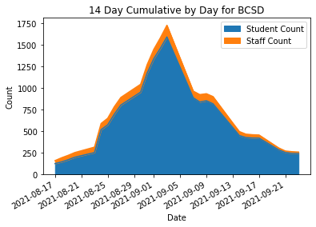
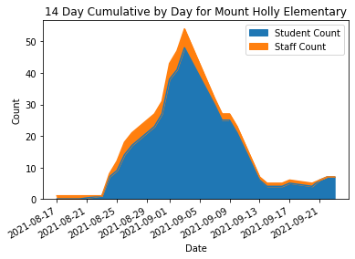
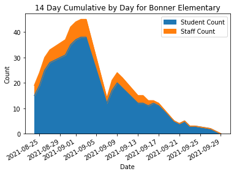
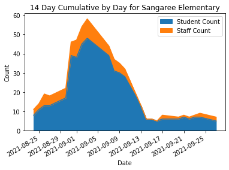

# BCSD Infographic notebook
This notebook provides various processing and infographics on COVID dashboard reporting for Berkeley County School District

## List all schools and areas the district is tracking

    The school district is tracking 85 schools, offices or departments.
    Here is the full list.
    Academic Services                  Administrative Services            Adult Education - Hanahan       
    Adult Education - Moncks Corner    Berkeley Alternative               Berkeley County School District 
    Berkeley Elementary                Berkeley High School               Berkeley Intermediate           
    Berkeley Middle                    Berkeley Middle College            Board of Education              
    Bonner Elementary                  Boulder Bluff Elementary           Bowens Corner Elementary        
    CDEP                               Cainhoy Elementary                 Cane Bay Elementary             
    Cane Bay High                      Cane Bay Middle                    Capital Improvements            
    Career Technical Ed                Central Offices                    Child Nutrition                 
    College Park Elementary            College Park Middle                Communications / Public Relations
    Cross Elementary                   Cross High                         Daniel Island School            
    Devon Forest Elementary            Dist Office Transportation         Evaluation &amp; Leadership         
    Financial Services                 First Steps                        Fishburne Campus                
    Foxbank Elementary                 Goose Creek Elementary             Goose Creek High                
    Hanahan Elementary                 Hanahan High                       Hanahan Middle                  
    Head Start                         Howe Hall Aims                     Human Resources                 
    JK Goudin Elementary               Jk Goudin Elementary               Lowcountry Regional Stem        
    Macedonia Middle                   Maintenance                        Marrington Elementary           
    Marrington Middle                  Mount Holly Elementary             Nexton Elementary               
    Office of Diversity                Operations / Administration        Philip Simmons Elementary       
    Philip Simmons High                Philip Simmons Middle              Program Support                 
    Safety and Security                Sangaree Elementary                Sangaree Intermediate           
    Sangaree Middle                    Sedgefield Middle                  Special Needs Transportation    
    Special Services                   St Stephen Elementary              St Stephen Middle               
    St. Stephen Elementary             St. Stephen Middle                 Stratford High                  
    Teacher Forum                      Technology                         Timberland High                 
    Transportation                     Transportation - Cainhoy           Transportation - Cross          
    Transportation - Goose Creek       Transportation - Moncks Corner     Transportation - St. Stephen    
    Westview Elementary                Westview Middle                    Westview Primary                
    Whitesville Elementary             

## Top 5 Highest Schools Today

###  By Student Count

<table border="1" class="dataframe">
<thead>
<tr style="text-align: right;">
<th></th>
<th>School</th>
<th>Date</th>
<th>Staff Count</th>
<th>Student Count</th>
<th>Staff Close Contacts</th>
<th>Student Close Contacts</th>
</tr>
</thead>
<tbody>
<tr>
<th>1588</th>
<td>Stratford High</td>
<td>2021-09-27</td>
<td>0</td>
<td>18</td>
<td>0.0</td>
<td>102.0</td>
</tr>
<tr>
<th>1568</th>
<td>Goose Creek High</td>
<td>2021-09-27</td>
<td>1</td>
<td>14</td>
<td>0.0</td>
<td>74.0</td>
</tr>
<tr>
<th>1548</th>
<td>Berkeley High School</td>
<td>2021-09-27</td>
<td>0</td>
<td>11</td>
<td>0.0</td>
<td>66.0</td>
</tr>
<tr>
<th>1571</th>
<td>Hanahan Middle</td>
<td>2021-09-27</td>
<td>0</td>
<td>9</td>
<td>0.0</td>
<td>30.0</td>
</tr>
<tr>
<th>1556</th>
<td>Cane Bay Elementary</td>
<td>2021-09-27</td>
<td>0</td>
<td>7</td>
<td>0.0</td>
<td>35.0</td>
</tr>
</tbody>
</table>

### By Staff Count

<table border="1" class="dataframe">
<thead>
<tr style="text-align: right;">
<th></th>
<th>School</th>
<th>Date</th>
<th>Staff Count</th>
<th>Student Count</th>
<th>Staff Close Contacts</th>
<th>Student Close Contacts</th>
</tr>
</thead>
<tbody>
<tr>
<th>1558</th>
<td>Cane Bay Middle</td>
<td>2021-09-27</td>
<td>2</td>
<td>4</td>
<td>2.0</td>
<td>24.0</td>
</tr>
<tr>
<th>1582</th>
<td>Sangaree Elementary</td>
<td>2021-09-27</td>
<td>2</td>
<td>5</td>
<td>1.0</td>
<td>26.0</td>
</tr>
<tr>
<th>1559</th>
<td>College Park Elementary</td>
<td>2021-09-27</td>
<td>2</td>
<td>6</td>
<td>2.0</td>
<td>44.0</td>
</tr>
<tr>
<th>1593</th>
<td>Whitesville Elementary</td>
<td>2021-09-27</td>
<td>2</td>
<td>3</td>
<td>0.0</td>
<td>26.0</td>
</tr>
<tr>
<th>1544</th>
<td>Technology</td>
<td>2021-09-27</td>
<td>1</td>
<td>0</td>
<td>0.0</td>
<td>0.0</td>
</tr>
</tbody>
</table>

## Top 5 Highest Schools All Time

###  By Student Count

<table border="1" class="dataframe">
<thead>
<tr style="text-align: right;">
<th></th>
<th>School</th>
<th>Date</th>
<th>Staff Count</th>
<th>Student Count</th>
<th>Staff Close Contacts</th>
<th>Student Close Contacts</th>
</tr>
</thead>
<tbody>
<tr>
<th>582</th>
<td>Stratford High</td>
<td>2021-09-03</td>
<td>6</td>
<td>116</td>
<td>NaN</td>
<td>NaN</td>
</tr>
<tr>
<th>545</th>
<td>Berkeley Middle</td>
<td>2021-09-03</td>
<td>7</td>
<td>104</td>
<td>NaN</td>
<td>NaN</td>
</tr>
<tr>
<th>553</th>
<td>Cane Bay Middle</td>
<td>2021-09-03</td>
<td>2</td>
<td>88</td>
<td>NaN</td>
<td>NaN</td>
</tr>
<tr>
<th>439</th>
<td>Berkeley High School</td>
<td>2021-09-01</td>
<td>2</td>
<td>78</td>
<td>NaN</td>
<td>NaN</td>
</tr>
<tr>
<th>500</th>
<td>Cane Bay High</td>
<td>2021-09-02</td>
<td>4</td>
<td>77</td>
<td>NaN</td>
<td>NaN</td>
</tr>
</tbody>
</table>

### By Staff Count

<table border="1" class="dataframe">
<thead>
<tr style="text-align: right;">
<th></th>
<th>School</th>
<th>Date</th>
<th>Staff Count</th>
<th>Student Count</th>
<th>Staff Close Contacts</th>
<th>Student Close Contacts</th>
</tr>
</thead>
<tbody>
<tr>
<th>577</th>
<td>Sangaree Elementary</td>
<td>2021-09-03</td>
<td>10</td>
<td>48</td>
<td>NaN</td>
<td>NaN</td>
</tr>
<tr>
<th>649</th>
<td>Berkeley Middle</td>
<td>2021-09-08</td>
<td>9</td>
<td>67</td>
<td>1.0</td>
<td>242.0</td>
</tr>
<tr>
<th>745</th>
<td>Whitesville Elementary</td>
<td>2021-09-09</td>
<td>8</td>
<td>42</td>
<td>2.0</td>
<td>111.0</td>
</tr>
<tr>
<th>29</th>
<td>Cane Bay High</td>
<td>2021-08-24</td>
<td>8</td>
<td>43</td>
<td>NaN</td>
<td>NaN</td>
</tr>
<tr>
<th>490</th>
<td>Berkeley Elementary</td>
<td>2021-09-02</td>
<td>8</td>
<td>32</td>
<td>NaN</td>
<td>NaN</td>
</tr>
</tbody>
</table>

## Graphs

### BCSD - 14 Day Cumulative reported daily

    On 2021-09-27 Student Count: 172. Staff Count: 15
    On 2021-09-24 Student Count: 230. Staff Count: 17
    Difference between 2021-09-27 and 2021-09-24. Student Count: -58. Staff Count: -2

    []

    

    

### Mount Holly Elementary

    On 2021-09-27 Student Count: 5. Staff Count: 0
    On 2021-09-24 Student Count: 6. Staff Count: 0
    Difference between 2021-09-27 and 2021-09-24. Student Count: -1. Staff Count: 0

    []

    

    

### Bonner Elementary

    On 2021-09-27 Student Count: 2. Staff Count: 0
    On 2021-09-24 Student Count: 3. Staff Count: 0
    Difference between 2021-09-27 and 2021-09-24. Student Count: -1. Staff Count: 0

    []

    

    

### Sangaree Elementary

    On 2021-09-27 Student Count: 5. Staff Count: 2
    On 2021-09-24 Student Count: 7. Staff Count: 2
    Difference between 2021-09-27 and 2021-09-24. Student Count: -2. Staff Count: 0

    []

    

    

    This file generated on 2021-09-27 23:51:28.604842 UTC

